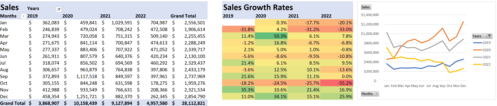

# Electra Electronics 
Electra Electronics is an e-commerce company that started in 2019 before the pandemic hit. The stakeholders requested a historical data analysis of its data from 2019-2022 to examine its sales trends and customer performance so that they may know what to expect from a post-pandemic market and how to better position themselves for it.

In particular, the stakeholders wanted to know the overall sales trends over time, the performance of the new loyalty program, refund rates, and average order values (AOV), in particular for Apple products.

North star metrics: Sales, AOV, and order counts

# Table of Contents
- [Summary of Insights](#summary-of-insights)
- [Technical Analysis](#technical-analysis)
- [Recommandations](#recommendations)
- [Technical Details](#technical-details)

# Summary of Insights
### Overall trends in sales
From 2019-2022, Electra Electronics made a total of $28M over 100k+ orders, with an average order value (AOV) of $260. The best performing year was 2020 at the height of the pandemic, with decreasing sales and AOV in the following years when the market slowly returned to pre-pandemic levels.

We see seasonal spikes in sales for March, July, and Nov-Dec. October and Jan-Feb show seasonal troughs. This suggests back-to-school and holiday sales drive those seasonal spikes and the trough are a response/return to normal non-event-driven spending.

The loyalty program is paying off, with recent years showing more sales, orders, and higher AOVs coming from loyalty program customers than non-loyalty program customers. There's a significant downturn in all northstar metrics at the end of 2022 that are unprecedented in the business's history. It's important to investigate what could've caused this - a new marketing roll out? Competitors? Consumer market shrinking? 

Apple brand products had an average 6% refund rate that totalled to 52,654 returned products and an AOV of $271, totalling to over $840K USD in returned merchandise over 4 years. Yearly refund rates were highest in 2020 at 10% and lowest in 2022 at 0%. The 0% may be a data completeness issue.

# Technical Analysis
SEASONALITY

BRANDS/PRODUCTS
When analyzing by product brands, there were more non-loyalty program customers who bought Apple products than loyalty program members at a ratio of 65:35. All other brands including generic products like the 27" monitor showed a roughly equal distribution between non- and loyalty program members.

Later analysis showed that 

# Recommendations
Future analysis could look into when customers join the loyalty program to explore strategies for better and faster conversion rates, and examine customer retention.

# Technical Details
The data used can be found in [Elist Data_cleaned](Elist Analysis.xlsx), and its ERD diagram at [ERD_diagram](assets/ERD_diagram.png).

I documented my steps in data cleaning and validation in [Electra Electronics Analysis](Electra Electronics Analysis.xlsx), where I used Excel filters, Pivot Tables, functions, and conditional formatting for the initial findings. I then imported the data tables into Google BigQuery to analyze them further[] with SQL.