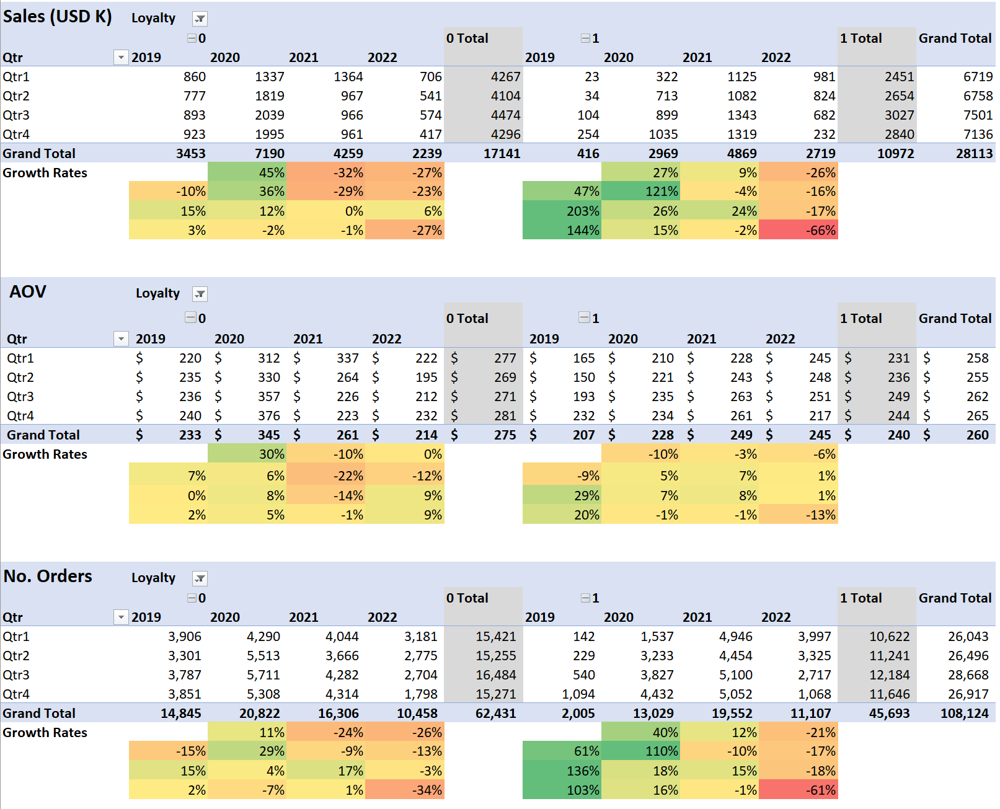
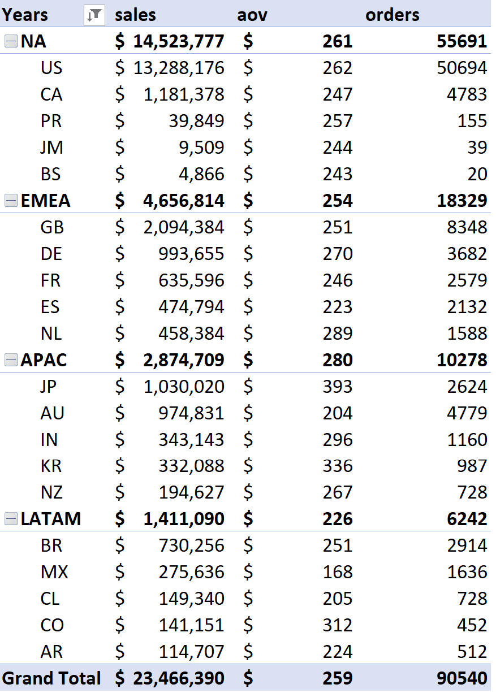

# Electra Electronics 
Electra Electronics is an e-commerce company that started in 2019 before the pandemic hit. The stakeholders requested a historical data analysis of its data from 2019-2022 to examine its sales trends and customer performance so that they may know what to expect from a post-pandemic market and how to better position themselves for it.

In particular, the stakeholders wanted to know the overall sales trends over time, the performance of the new loyalty program, refund rates, and average order values (AOV), in particular for Apple products.

All data and analysis tables used can be found in [Elecra Electronics Analysis](Elecra Electronics Analysis.xlsx), where all steps in data cleaning and validation have been documented. Its ERD diagram at [ERD_diagram](assets/ERD_diagram.png). I then imported the data tables into Google BigQuery to analyze them further with SQL.

The north star metrics: 
- Sales
- Average order value (AOV)
- Order counts

## Summary of Insights
### Overall trends in sales
Yearly average sales were \$7M in 27K orders, with an AOV of \$254. From 2019-2022, total sales were \$28M over 100K+ orders, with an AOV of \$260. The best performing year was 2020 that saw \$10.1M with 33K orders and \$300 AOV, spiking due to the pandemic and decreasing to pre-pandemic levels in later years. Despite this return, all north star metrics outperform those of 2019.

### Seasonality
- Seasonal spikes occur in March, July, and Nov-Dec, while seasonal troughs occur in October and Jan-Feb. This suggests back-to-school and holiday sales drive those seasonal spikes and the trough are a return to normal non-seasonal spending.

### Loyalty Program
- The loyalty program is successful, with 2021-2022 data showing that loyalty program customers consistently outperformed non-loyalty program customers on all north star metrics. 
- Non-loyal customer base shows less fluctuation in overall sales performance throughout the year.
- 2022's Q4 showed a significant dip in all metrics for loyalty program customers, lower than even pre-pandemic levels.

### Platforms
- The most effective marketing channels were direct and email marketing, regardless of loyalty program status, and drew in about 78% and 17% of all orders.
- For all years, customers placed larger orders when they used the website instead of the mobile app, with 2022's AOVs being \$294 and \$36 for the site and app, respectively. The AOVs across years stayed relatively stable for the site, but plummeted for the mobile app.
- The AOVs for customers who were reached across marketing channels were relatively stable across the board and over the years.
- There's a data completeness issue that might offer further insight if resolved.

### Brands
- When analyzing by product brands, there were more non-loyalty program customers who bought Apple products than loyalty program members at a ratio of 65:35.
- All other brands including generic products like the 27" monitor showed a roughly 50/50 distribution between non- and loyalty program members.

### Refunds
- The most refunded items in count were the 27in 4K gaming monitor and Apple Airpods Headphones at 1.4K and 2.6K refunded and totalling to an estimated \$607K and \$421K of potential sales, respectively.
- The most refunded items in rate were the Macbook Air and ThinkPad laptops at 11% and 12% respectively, which were also items with the highest AOV.
- Apple brand products had an average 6% refund rate that totalled to 52,654 returned products and an AOV of \$271, totalling to over \$840K USD in returned merchandise over 4 years. Yearly refund rates were highest in 2020 at 10% and lowest in 2022 at 0%. The 0% may be a data completeness issue that should be investigated.

### Regions
- North America had the most sales overall, making up 50% of total sales over the years with \$14M, where the US made up 91% of that figure.
- Europe, Middle East, and Africa made up 16% of total sales, with Great Britain making up 45% of that figure.
- Asia Pacific showed the highest AOV of all regions.
- There were no particular region-specific trends, and north star metrics, their growth rates, and loyalty program sign-up numbers were proportional across regions when accounting for the number of consumers.

## Recommendations
### Seasonality
- Capitalize on seasonal spikes would be the easiest way to drive sales. Further investigation on customer demographics could position us to expand product offerings to better meet the customers wants and needs.

### Loyalty Program
- Expanding the customer base will be crucial, especially as the products offered should last several years, which cuts into expected repeated spending from customers in the loyalty program.
- Analyze what happened in 2022 Q4 inside the company and market to see if more factors are at play than just pandemic-related fluctuations - new marketing initiatives, ad campaigns, demands of loyal customers and market consumers.
- Future analysis could look into when customers join the loyalty program to explore strategies for better and faster conversion rates, and examine customer retention.

### Refunds
- 2022 shows a 0% refund rate across all items, which could be a data completeness issue that should be investigated.

### Regions
- Continue to capitalize on the NA, EMEA, and APAC markets, reaching more customers through direct and email purchase channels.
- More expensive new product offerings could be tested in the APAC market, which has the highest customer AOV.